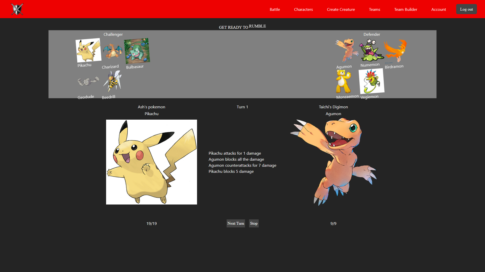

# Battle of the Brands (Web)

## Overview

### Preview



## Features

### Characters

The character browser lets you create new characters, edit your characters, and see other characters. You can favorite characters to add them to a separate list.

### Teams

The team browser shows all teams, your favorite teams, and the best teams.

### Social System

Users can follow each other and see both their following and follower list from their profile.

### Battles

Visualizes two teams fighting in turn based combat.

## Tech Stack

### [Image Upload](https://api.market/store/magicapi/image-upload)

We use an image upload api to allow users to upload any image they want for their characters. This lets us save on space by storing the url given by the image upload api.

### [React Select](https://react-select.com/home)

We use a special select dropdown for the team builder to allow users to search for characters.

## Architecture

## Folder Structure

```text
.
├── public/
└── src/
    ├── api/
    ├── auth/
    ├── layout/
    ├── pages/
    ├── styles/
    ├── App.jsx
    └── main.jsx
```
